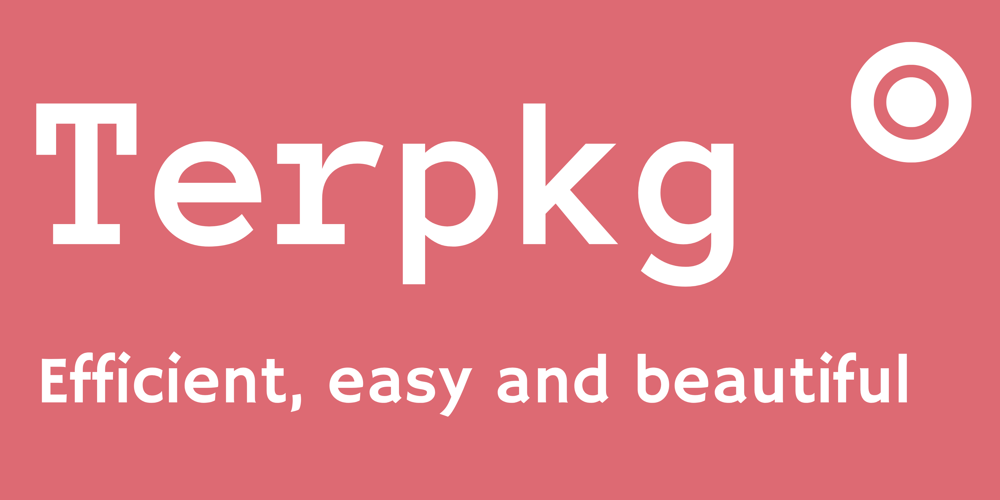

> [!NOTE]
> **Terpkg is currently in its alpha stage, which means it is still in the early phases of development. As a result, users may encounter some bugs, glitches, or unexpected behavior while using the software. The developer is actively working to identify and fix these issues, so over time, the stability and reliability of Terpkg will improve significantly. It’s important for users to keep in mind that since the software is still being refined, occasional problems are to be expected during this period.**



---

**Terpkg** Terpkg is a comprehensive project manager designed specifically for the Terlang programming language. It simplifies the entire process of creating, running, and managing your Terlang projects by providing a streamlined and user-friendly interface. With Terpkg, developers can automate build tasks and organize their codebase efficiently, allowing them to focus more on writing quality code and less on manual setup

---

## Installation 📦

To install **Terpkg**, use the `make` command in the project directory:

```bash
git clone https://github.com/gatulindu/terpkg
cd terpkg
make
sudo make install
```
## `--init`
Creates a new Terlang project in the current directory 📁

```bash
terpkg --init
```
## `--run`

Runs the Terlang code of the current project ⏩

```bash
terpkg --run
```
## `--help`
Displays help information about how to use terpkg 😶‍🌫️

```bash
terpkg --help
```
## Quick Example ✨

```bash
terpkg --init   # Creates a new project
terpkg --run    # Runs the project
```
## License 🪪

[MIT License](https://github.com/gatulindu/terpkg/blob/main/LICENSE)

## Contact 📞
For questions and contributions, please open an issue or send an email to your gatulindu@keemail.me
